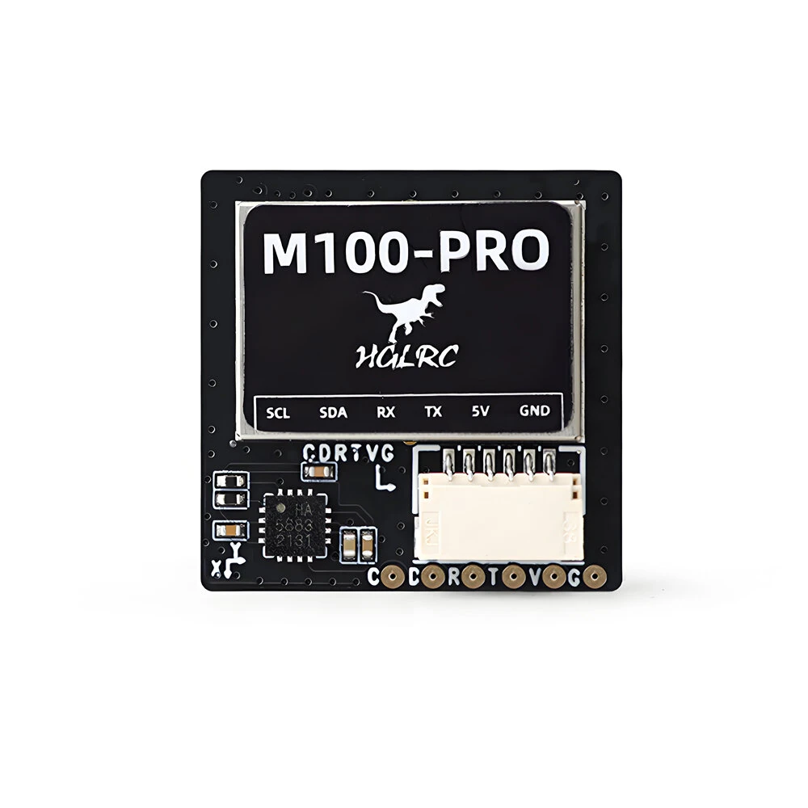

# u-blox GPS
u-blox make high quality GPS modules\
The one I describe here is an **M100-pro** module by _HGLRX_\
This module sends it's positioning information in the **ubx hex format**

  
 image of module 

  

By default the output from this gps is in **UBX-NAV-PVT** format. See [UBX_NAV_PVT.md](UBX_NAV_PVT.md)

[official complete datasheet](https://www.peak-system.com/produktcd/Pdf/English/PCAN-GPS-FD_UserManAppendix_GNNS_InterfaceDescription.pdf)
